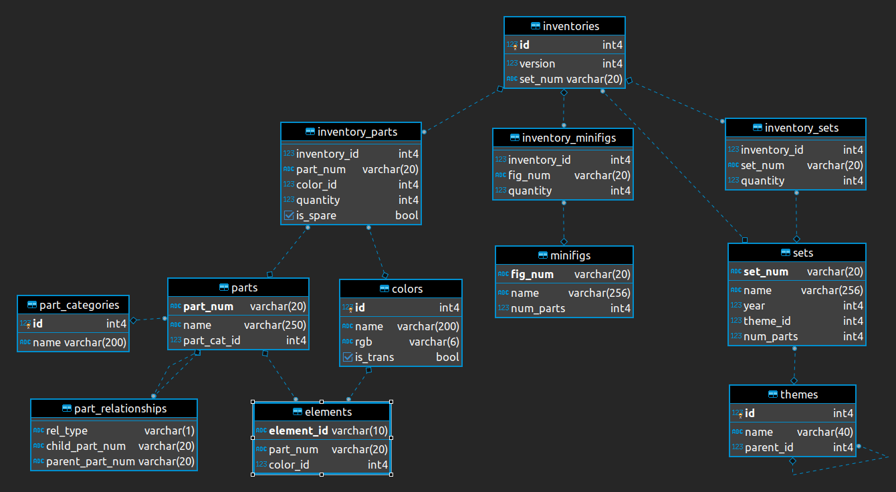

# Lego Analysis

The aim of this project is to analyse the dataset from https://rebrickable.com consisting 12 csv files containing information about pure lego sets (no information about pricing/production etc.).
We made problems to solve by ourselves focused on the sets, its uniqueness by parts, colors and minifigures.
We use the PCA in order visualize themes similarity where the features are number of elements, figures and unique elements.

## Database:



## How to run this project

### Setting up virtual environment and installing requirements

After cloning the repository set up virtual environment and install requirements

```
python -m venv venv 
source venv/bin/activate
pip install -r requirements.txt
```

### Runing the project using DVC
This project uses DVC (Data Version Control) to run data processing pipelines. 

#### Running the project without access to remote storage (should always work)

```
dvc repro
```

#### Running the project by pulling from remote storage
To download datasets set-up password to remote SSH storage, and pull the data:
```
dvc remote modify --local ssh-storage password [put_password_here]
dvc pull
```

### Seeing the results

You should find prepared plots inside plots directory and prepared csv files inside results directory.
